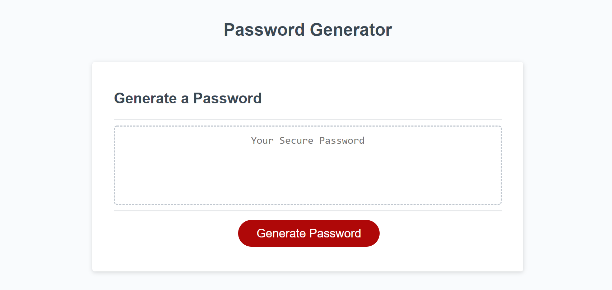
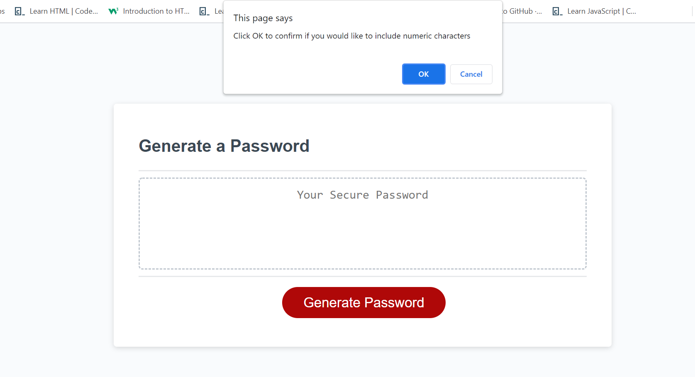
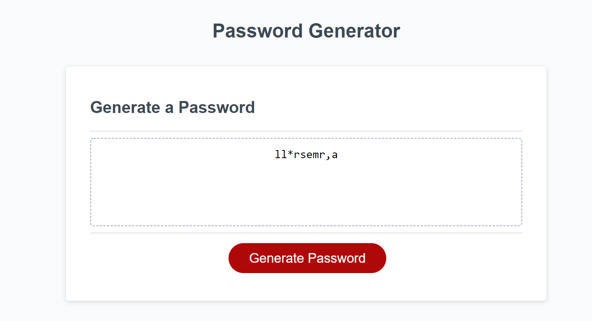

# PASSWORD-GENERATOR

## INTRODUCTION

- The aim of this project is to generate a password by asking the user to choose from 4 parameters of special characters, numeric characters, upper-case alphabets and lower-case alphabets.
- The password-generator generates a passoword of 8-128 characters length and does not execute if the number of characters is less than 8 or more than 128.

## TOOLS USED

- We used HTML to make the webpage and styled it using CSS
- The main logic is written in JavaScript .

## SCREENSHOTS

The following is the image of appearance of the Password-generator website 

## ASSETS

- The follwing is the link to the deployed github code: https://github.com/SrilalithaN/Password-Generator
- The following is the link to deployed github application: https://srilalithan.github.io/Password-Generator/

## CREDITS

Used google search engine , youtube tutorials and resources from instructors to achieve the output for this project.
